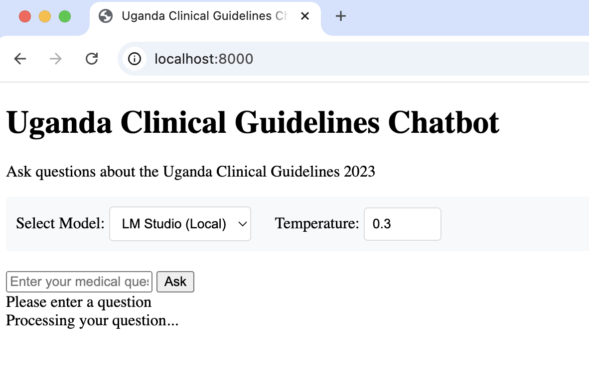

```git clone <your-repo>```

```conda env create -f environment.yml```

```conda activate uganda-rag```

The LM Studio(Local) model is llama-3.2-3b-instruct.
The GPT model is GPT-4 (create a .env file in the root folder of the git repo, put your OPENAI_API_KEY=XXXX there)

Open LM Studio, load the llama-3.2-3b-instruct model, then go to the git repo, 
run

```python start.py```.

```python main.py```.

go to your browser ```http://localhost:8000/```



